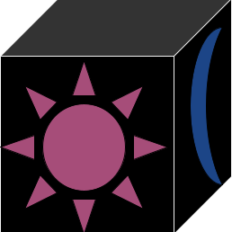

# Relight Team

  

## Our Goal

Our Goal is to provide a robust game engine by utilizing the knowledge of Unreal Engine without copying any of the code. Allowing the technology of Unreal Engine to be in the hands of the open source community.

## Code of conduct

While we like to keep the Code of Conduct to the bare minimum, there are some rules that are required to be addressed

### Community, fourms, etc

1. Any harassment or hateful speech against race, gender, gender identity, religion, region, place of origin, age, etc, will not be tolerated. (pretty much, don't be an asshole).
2. This community and engine will remain APOLITICAL! No political discussion whatsoever, the only exception are any opinion towards Epic Games/Unreal Engine, but even then, you must remain unbiased.
3. Admins cannot abuse their power on any official Relight content

### Code

1. Swearing in the source code is fine, however derogatory slurs are prohibited
2. All code must NOT include any code from Unreal Engine, every code written is original
3. There must be NO reference of Unreal Engine in the source code, including comments. (i.e. variables named "UE", comments talking about Unreal engine, etc)
4. maintainers can only be banned from the rules above only, if they didn't break any rules, THEY CANNOT BE BANNED
5. While not enforced, it is heavily recommended to user UpperCamelcase for naming in the code (for example, "SetText")
  - I understand not everyone will like this, but I'm very used to it, and I like to keep the engine consistent, feel free to undo it in your personal projects, but in the engine codebase, gotta do it
