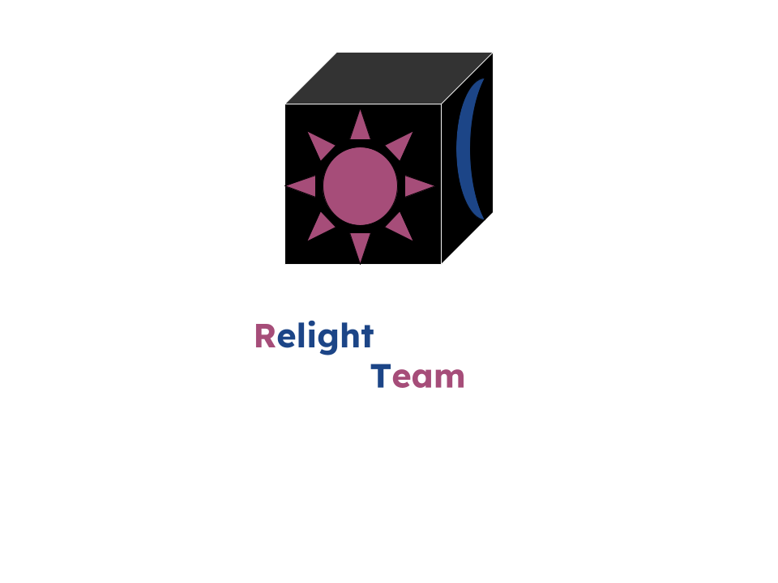

# Relight Team

  

## Our Goal

Our Goal is to provide a robust game engine by utilizing the knowledge of Unreal Engine without copying any of the code. Allowing the technology of Unreal Engine to be in the hands of the open source community.

## How do we achieve our goal?

We highly recommend reading the introduction document created by Ethanboilol here: https://docs.google.com/document/d/1lz-SuTzNYdPNftVpxN6RxchnxQk76aOg5xMoQJMfOUo/edit?usp=sharing

## Code of conduct

### Community, fourms, etc

1. Any harassment or hateful speech against race, gender, gender identity, religion, region, place of origin, age, political views, etc, will not be tolerated.
2. Don't be an asshole.
3. Keep controversial opinions to yourself unless it's related to Unreal Engine or Relight Engine.

### Code

1. Swearing in the source code is fine, however derogatory slurs are prohibited (n word, r word, etc)
2. All code must NOT include any code from Unreal Engine, every code written is original
3. There must be NO reference of Unreal Engine in the source code, including comments. (i.e. variables named "UE", comments talking about Unreal engine)
